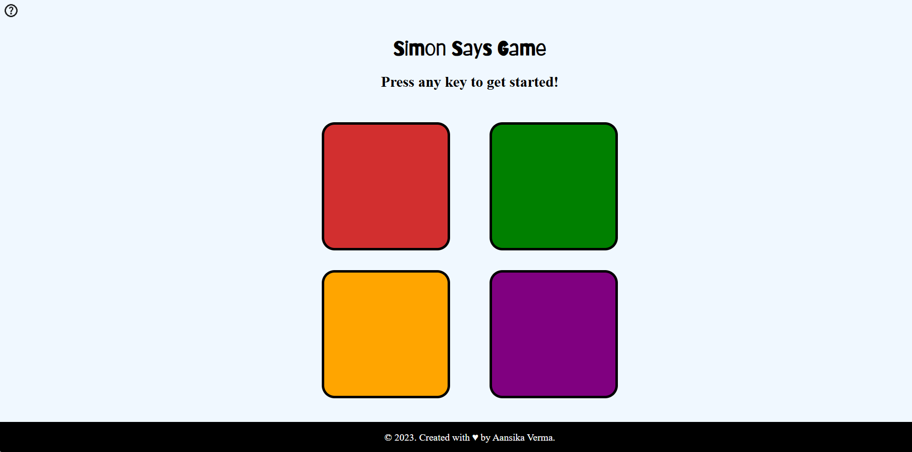

# 🎯 Simon Says Game

A fun and interactive memory challenge game built using HTML, CSS, and JavaScript!
This is my take on the classic Simon Says game, with an additional “Need Help?” section to guide new players on how to play.

 

<h2>I. Features </h2>

<ul>
    <li>Clean & Responsive UI – Works seamlessly across devices.</li>
    <li>Clean & Responsive UI – Works seamlessly across devices.</li>
    <li>Challenging Gameplay – Remember and repeat tile sequences to level up.</li>
    <li>Level & Scoring System – Earn 10 points for each level you pass.</li>
    <li>Need Help Section – In-game guide to help players understand the rules.</li>
    <li>Smooth Animations – Visually appealing tile flashes for better gameplay experience.</li>
</ul>

<h2>II. How to Play</h2>
<ul>
    <li>The game starts with one tile flashing. Click that tile to pass Level 1.</li>
    <li>In the next level, a new tile will flash. Now click the previous tile(s) in sequence followed by the new one.</li>
    <li>Each level adds one more tile to the sequence.</li>
    <li>Level & Scoring System – Earn 10 points for each level you pass.</li>
    <li>Earn 10 points per level.</li>
    <li>Click the wrong tile? Game Over – your score will be displayed.</li>
</ul>

<b>💡 Tip: Focus, memorize, and aim for the highest score possible!</b>

<h2>🛠️ Technologies Used</h2>

<ul>
    <li>HTML5 – Structure and game layout.</li>
    <li>CSS3 – Styling, animations, and responsiveness.</li>
    <li>JavaScript (Vanilla) – Game logic, event handling, and scoring system.</li>
</ul>

